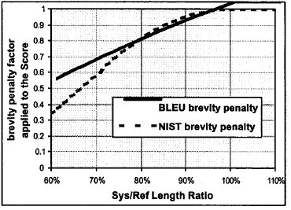

# 文本生成评价指标

> [原文链接](https://zhuanlan.zhihu.com/p/144182853)


1. 以 BLEU 为代表的基于统计的文本评价指标
   - BLEU
   - ROUGE
   - NIST
   - METEOR
   - TER
2. Data-To-Text / Image-Caption 特有的评价模式
3. 词向量评价指标
4. 基于语言模型的方法
5. 基于 BERT 等预训练模型的文本评价指标

## 1. 基于统计的文本评价指标

**机器翻译和文本摘要任务的常用指标：**

**基于词重叠率的方法**是指在词汇级别计算模型生成文本和实际文本之间的相似性，比较经典的代表有：BLEU，METEOR 和 ROUGE；其中 BLEU 和 METEOR 常用于机器翻译任务，ROUGE 常用于文本摘要任务。

### BLEU

BLEU (Bi-Lingual Evaluation Understudy，双语评估辅助工具)，可以说是所有评价指标的鼻祖。它的核心思想是比较文本 n-gram 的重合程度，重合程度越高就认为译文质量越高。

其中 unigram 用于衡量单词翻译的准确性，高阶 n-gram 用于衡量句子翻译的流畅性。实践中，通常取 N=1~4，然后对其进行加权平均。

$$BLEU = BP \times \exp(\sum_{i=1}^N {W_n \times \log{P_n}}) \\
BP = \begin{cases}
    1 & lc \gt lr\\
    \exp(1-{lr}/{lc}) & lc \le lr
\end{cases}
$$
$$
lc = 机器译文的长度，lr = 最短的参考译文的长度
$$

- BLEU 需要计算译文 1-gram，2-gram，...，N-gram 的精确率，一般 N 设置为 4 即可，公式中的 $P_n$ 指 n-gram 的精确率。
- $W_n$ 指 n-gram 的权重，一般会设为均匀权重，对于任意 n 都有 $W_n=1/N$。
- BP 是惩罚因子，如果译文的长度小于最短的参考译文，则 BP 小于 1。
- BLEU 的 1-gram 精确率表示译文忠于原文的程度，而其他的 n-gram 表示翻译的流畅程度。

不过 BLEU 对词重复和短句有着非常不好的表现，所以改进的 BLEU 分别使用**改进的多元精度(n-gram precision)**和**短句惩罚因子**进行了优化。

**改进的多元精度(n-gram precision)**

假设机器翻译的译文 $C$ 和一个参考翻译 $S1$ 如下：

```
C: a cat is on the table
S1: there is a cat on the table
```

则可以计算 1-gram，2-gram，… 的精确率：

- $P_1$：由于 a cat is on the table 分别都在参考译文 $S1$ 中，所以 $P_1=1$
- $P_2$：(a, cat) 在，(cat, is) 不在，(is, on) 不在，(on, the) 在，(the, table) 在，所以 $P_2=3/5$
- $P_3$：(a, cat, is) 不在，(cat, is, on) 不在，(is, on, the) 不在，(on, the, table) 在，所以 $P_3=1/4$

以此类推… 

但是这样计算会存在很大的问题，例如：
```
C: there there there there there there
S1: there is a cat on the table
```

这时候机器翻译的结果明显是不正确的，但是 1-gram 的精确率 $P_1=1$。因此 BLEU 一般会使用修正的方法：给定参考译文 $S1, S2, ..., Sm$，计算译文 $C$ 中 n 元组的精确率。

计算公式：

$$
P_n=\frac{\sum_{i \in \text{n-gram}}\min(h_i(C), \max_{j \in m}h_i(S_j))}{\sum_{i \in \text{n-gram}}h_i(C)}
$$
$$
i: C \text{ 里的 n-gram}
\\
h_i(C): \text{n-gram } i \text{ 在 } C \text{ 里出现的次数}
\\
h_i(S_j): \text{n-gram } i \text{ 在第 } j \text{ 个参考译文出现的次数}
$$

针对上面的例子 $P_1=1/5$。

**惩罚因子**

上面介绍了 BLEU 计算多元精度的方法，但仍存在一些问题：当机器翻译的长度比较短时，BLEU 得分会比较高，但事实上这个翻译会损失很多信息，例如：

```
C: a cat
S1: there is a cat on the table
```

因此需要在 BLEU 分数上乘上乘法因子：

$$
BP = \begin{cases}
    1 & lc \gt lr\\
    \exp(1-{lr}/{lc}) & lc \le lr
\end{cases}
$$
$$
lc = 机器译文的长度，lr = 最短的参考译文的长度
$$

**BLEU 优点：**

- 易于计算且速度快，特别是与人工翻译模型的输出对比
- 应用范围广泛，可以轻松将你的模型与相同任务的基准做对比

**BLEU 缺点：**

- 没有考虑语义和句子结构
- 不能很好地处理形态丰富的语句（BLEU 原文建议大家配备 4 条参考译文）
- BLEU 指标偏向于较短的翻译结果（brevity penalty 没有想象中那么强）

### ROUGE

ROUGE（Recall-Oriented Understudy for Gisting Evaluation），可以看作是 BLEU 的改进版，专注于**召回率**而非精度。换句话说，它会查看有多少个参考译文中的 n 元词组出现在了预测结果中。

ROUGE 大致分为四种（常用的是前两种）：

1. ROUGE-N: 将 BLEU 的 Precision 优化为 Recall
2. ROUGE-L: 将 BLEU 的 n-gram 优化为公共子序列
3. ROUGE-W: 将 ROUGE-L 的连续匹配给予更高的奖励
4. ROUGE-S: 允许 n-gram 出现跳词（skip）

ROUGE 用作机器翻译评价指标的初衷是这样的：在 SMT（统计机器翻译）时代，机器翻译效果比较差，需要同时评价翻译的准确度和流畅度；到 NMT（神经网络机器翻译）出现之后，神经网络翻译出的结果都是通顺的，但有时候容易瞎翻译。

ROUGE 的出现很大程度上是为了解决 NMT 的漏翻问题（低召回率），所以 ROUGE 只适合评价 NMT，但不适用于 SMT，因为它不管译文是否流畅。

#### ROUGE-N

N 指的是 N-gram，其计算方式与 BLEU 类似，只是 BLEU 基于 Precision，而 ROUGE 基于 Recall。

ROUGE-N 主要统计 N-gram 上的召回率，对于 N-gram，可以计算得到 ROUGE-N 分数：

$$
ROUGE\text{-}N = \frac{\sum_{S \in \lbrace ReferenceSummaries \rbrace}\sum_{gram_N \in S}Count_{match}(gram_N)}{\sum_{S \in \lbrace ReferenceSummaries \rbrace}\sum_{gram_N \in S}Count(gram_N)}
$$

公式的分母统计参考译文中 N-gram 的个数，分子统计参考译文与机器译文公有的 N-gram 个数。

例如：

```
C: a cat is on the table
S1: there is a cat on the table
```

ROUGE-1 和 ROUGE-2 的分数如下：

$$
ROUGE\text{-}1 = \frac{\lvert a, cat, is, on, the, table \rvert}{\lvert there, is, a, cat, on, the, table \rvert} = \frac{6}{7}
$$
$$
ROUGE\text{-}2 = \frac{\lvert (a, cat), (on, the), (the, table) \rvert}{\lvert (there, is), (is, a), (a, cat), (cat, on), (on, the), (the, table) \rvert} = \frac{1}{2}
$$

如果给定 $M$ 个参考译文 $S_1, ..., S_M$，ROUGE-N 会分别计算机器译文和这些参考译文的 ROUGE-N 分数，并取其最大值：

$$
ROUGE\text{-}N_{multi}= \max_i ROUGE\text{-}N(S_i, C)
$$

这个方法也可以用于 ROUGE-L，ROUGE-W 和 ROUGE-S。

#### ROUGE-L

ROUGE-L 中的 L 指最长公共子序列（longest common subsequence, LCS），ROUGE-L 计算时使用了机器译文 $C$ 和参考译文 $S$ 的最长公共子序列。

计算公式：

$$
R_{LCS} = \frac{LCS(C, S)}{len(S)}
\\
P_{LCS} = \frac{LCS(C, S)}{len(C)}
\\
F_{LCS} = \frac{(1+\beta^2)R_{LCS}P_{LCS}}{R_{LCS}+\beta^2P_{LCS}}
$$

其中，$R_{LCS}$ 表示召回率，$P_{LCS}$ 表示精确度，$F_{LCS}$ 就是 ROUGE-L。一般来说，$\beta$ 会设置为很大的数，因此 $F_{LCS}$ 几乎只考虑了召回率 $R_{LCS}$。

#### ROUGE-W

ROUGE-W 是 ROUGE-L 的改进版，考虑下面的例子，$X$ 表示参考译文，而 $Y_1$，$Y_2$ 表示两种机器译文。

$$
\begin{aligned}
X\text{: }& \text{[\underline{A} \underline{B}  \underline{C} \underline{D} E F G]}
\\
Y_1\text{: }& \text{[\underline{A} \underline{B}  \underline{C} \underline{D} H I K]}
\\  
Y_2\text{: }& \text{[\underline{A} H \underline{B} K \underline{C} I \underline{D}]}
\end{aligned}
$$

在这个例子中，明显 $Y_1$ 的翻译质量更高，因为 $Y_1$ 有更多连续匹配的翻译，但是采用 ROUGE-L 计算得到的分数确是一样的，即 $ROUGE\text{-}L(X, Y_1)=ROUGE\text{-}L(X, Y_2)$。因此作者提出了一种加权最长公共子序列方法（WLCS），给连续翻译正确的结果更高的分数，具体做法可以阅读原文【ROUGE: A Package for Automatic Evaluation of Summaries】。

#### ROUGE-S

ROUGE-S 也是对 N-gram 进行统计，但是它采用的 N-gram 允许跳词（Skip），即跳跃二元组（skip bigram）。例如句子 "I have a cat" 的 skip 2-gram 包括 (I, have), (I, a), (I, cat), (have, a), (have, cat), (a, cat)。

跳跃二元组是句子中有序的单词对，和 LCS 类似，在单词对之间，单词可能被跳过。比如一句有 4 个单词的句子，按照排列组合就可能有 6 种跳跃二元组。

再次使用精度和召回率来计算 $F$，将第 $j$ 个参考译文 $s_{ij}$ 中的跳跃二元组 $k$ 的个数记为 $f_k(s_{ij})$，计算公式如下：

$$
R_{S} = \max_j\frac{\sum_k\min(f_k(c_i),f_k(s_{ij}))}{\sum_kf_k(s_{ij})}
\\
P_{S} = \max_j\frac{\sum_k\min(f_k(c_i),f_k(s_{ij}))}{\sum_kf_k(c_i)}
\\
ROUGE_{S}(c_i, S_i) = \frac{(1+\beta^2)R_{S}P_{S}}{R_{S}+\beta^2P_{S}}
$$

### NIST

NIST（National Institue of standards and Technology）方法是在 BLEU 方法上的一种改进。最主要的是引入了**每个 n-gram 的信息量**（information）的概念，BLEU 算法只是单纯的将 n-gram 的数目加起来，而 NIST 是将得到信息量累加起来再除以整个译文的 n-gram 片段数目，这就相当于加大一些出现少的重点词的权重。

信息量的计算公式：

$$
Info(w_1 ... w_n)=\log_2(\frac{\text{the } \# \text{ of occurences of }w_1 ... w_{n-1}}{\text{the } \# \text{ of occurences of }w_1 ... w_n})
$$

其中，分母计算 n 元词在参考译文中的出现次数，分子是对应的 n-1 元词在参考译文中的出现次数。对于一元词汇，分子的取值就是整个参考译文的长度。这里的公式和解释没看懂，但是感觉类似于逆文档频率，n 元词出现次数越少代表它的信息量越大。

计算信息量之后，就可以对每一个共现的 n 元词乘以它的信息量权重，再进行加权求平均得出最后的评分结果：

$$
score=\sum_{n=1}^N \lbrace \frac{\sum_{\text{all }w_1 ... w_n \text{ that co-occur}}Info(w_1 ... w_n)}{\sum_{\text{all }w_1 ... w_n \text{ in sysoutput}}(1)} \rbrace \cdot \exp \lbrace\beta\log^2\lbrack \min(\frac{L_{sys}}{\overline{L}_{ref}}, 1)\rbrack\rbrace
$$

注意：

1. N 一般取 5
2. $\beta$ 是一个常数，在 ${L_{sys}}/{\overline{L}_{ref}}=2/3$ 时，$\beta$ 使得长度惩罚率为 0.5，它是个经验值，大概的曲线是：
   
    

3. $\overline{L}_{ref}$ 是参考答案的平均长度
4. $L_{sys}$ 是译文长度

参考：[机器翻译评测——BLEU改进后的NIST算法](https://www.cnblogs.com/by-dream/p/7765345.html)

#### METEOR

和 BLEU 不同，METEOR 同时考虑了整个语料库上的精确率和召回率，从而得出最终的分数。

METEOR 也包括其他指标没有发现的一些其他指标，如**同义词匹配**等。METEOR用 WordNet 等知识源扩充了同义词集，同时考虑了单词的词形（词干相同的词也认为是部分匹配的，也应该给予一定的奖励，比如说把 likes 翻译成了 like 总比翻译成别的乱七八糟的词要好吧？）

在评价句子流畅性的时候，用了 chunk 的概念（候选译文和参考译文能够对齐的、空间排列上连续的单词形成一个 chunk，这个对齐算法是一个有点复杂的启发式 beam serach），chunk 的数目越少意味着每个 chunk 的平均长度越长，也就是说候选译文和参考译文的语序越一致。

最后，METEOR 计算为对应最佳候选译文和参考译文之间的准确率和召回率的调和平均：

#### TER

## 2. Data-To-Text / Image-Caption 特有的评价模式

## 3. 词向量评价指标

## 4. 基于语言模型的方法

## 5. 基于 BERT 等预训练模型的文本评价指标