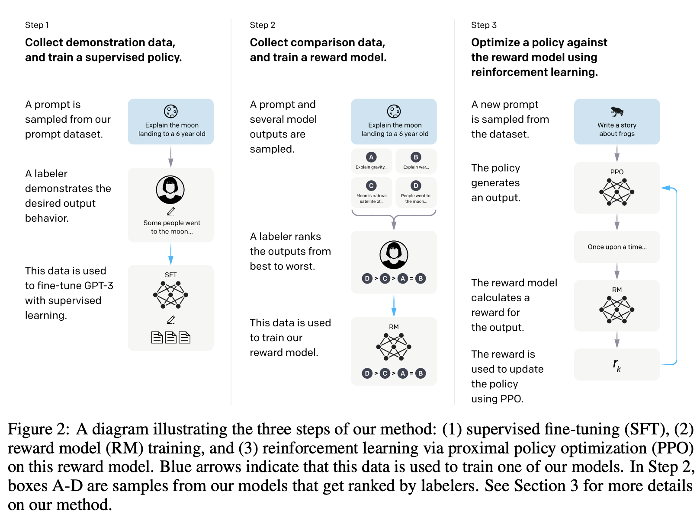

# GPT-4

- 原视频：[GPT-4论文精读](https://www.bilibili.com/video/BV1vM4y1U7b5)  
- 论文：[GPT-4 Technical Report](https://arxiv.org/abs/2303.08774)，[GPT-4 Research](https://openai.com/research/gpt-4)

## 导言

> We’ve created GPT-4, the latest milestone in OpenAI’s effort in scaling up deep learning. GPT-4 is a large **multimodal model** (accepting **image and text inputs**, emitting **text outputs**) that, while less capable than humans in many real-world scenarios, exhibits human-level performance on various professional and academic benchmarks.

GPT-4 是多模态模型，接受输入文本或图片，输出文本。
写代码：[GitHub Copliot](docs.github.com/copilot)

对比 GPT-3.5 的性能提升，例如：
- GPT-4 可以通过律师资格证考试，且排名前10%
- GPT-3.5 无法通过，排名后10%

## 训练过程
1. 预训练：通过预测文章中下一个词的方式训练，Language Modeling Loss
2. ALign：为了使结果符合人的真实需求，使用 RLHF 方法微调，Reinforcement Learning With Human Feedback
3. 模型的能力主要来自于预训练，RLHF 用于正确理解用户的意图，并给出用户真正想要的回答

## 可预测的扩展
1. 重建训练的 infra
2. 在训练过程中推测出训练完成后的 loss
3. 节省算力
4. 用更快的速度，试更多的方法，达到更好的效果

## 大模型的弊端
1. 随着模型越来越大，模型越来越不理智，做决策时越来越受结果影响
2. GPT4 不会受结果的影响

## 能力
1. 在平常的对话中 GPT 3.5 和 GPT 4 的差别比较小，但随着任务越来越难，差别越来越显现出来，例如考试竞赛等
2. 在测试上 Open AI 没有做过特殊的模型预训练，做了两次实验，去除了问题相关的训练数据
3. 表现不好的领域：数学，英文写作

### 多语言上的能力
1. 在纯英语的语料库上训练，但可以理解多语言，机器翻译？
2. 多语言的能力与语系有关
3. 应该是收集了中文的语料库
	
## 视觉输入
1. GPT4 终于是一个多模态的模型了
2. 测试合作：Be My Eyes

## 定义它的行为
System Message：用户可以定义 GPT4 以什么样的身份语气来和你交谈
- System：
- User：
- GPT-4：
	
## Limitation
1. 不完全可靠，有时会瞎编乱造，使用时要小心
2. 带有偏见
3. 缺少2021/09之后的信息
4. 容易受骗
5. 非常自信，但经多 post-training process 之后，校准有所下降

## 总结
GPT-4 与 GPT-3.5 比较：
1. 重构了训练模型的 infra，可以在训练过程中就预测出模型的最终 Loss，节省了算力，用更快的速度，试更多的方法，达到更好的效果
2. 多模态模型，可以接收图片作为输入了
3. 能力上，特别是困难任务上有了比较大的性能提升

# InstructGPT

- 原视频：[InstructGPT 论文精读](https://www.bilibili.com/video/BV1hd4y187CR)  
- 论文：[Training language models to follow instructions with human feedback](https://arxiv.org/pdf/2203.02155.pdf)

## 摘要
**痛点：** 把语言模型变大并不是意味着它们能更好的理解人类的意图。大的语言模型很有可能生成一些不真实的，有毒的，没有帮助的答案。换句话说，没有和人 aligned。

对一个发布了的模型来说安全性非常重要。

**文章主要研究内容：** 怎么对语言模型和人类的意图之间做 align
1. Fine-tuning with human feedback：在 Open AI 的 API 中收集了很多问题然后使用标注工具把答案写出来，在这个数据集上进行监督学习来对 GPT-3 来进行微调。
2. 对模型的每次输出，人工标注优劣，做一个排序的数据集，用强化学习继续训练模型，训练出的模型就叫做 InstructGPT 。

**结果：**
1. InstructGPT 仅用 1.3B 的参数就做到了，比 GPT-3 175B 参数更好的效果；
2. InstructGPT 能够减少有毒的答案
3. 公开的 NLP 数据集上效果也没有变差

## 导论
**问题：**

大的语言模型，能够通过提示（prompt）的方法，把你的任务作为它的输入；但是这种大语言模型有时也会产生一些你不想要的行为，比如捏造事实，生成有偏见或有毒的输出，或者没有按照你想要的方法来回答。

作者认为这是因为训练语言模型的目标函数不是那么正确：语言模型的目标函数是对网络上的文本预测下一个词；这个目标函数和我们想要让语言模型按照我们的指示来有帮助的和安全的来生成答案其实是有不一样的。

语言模型的目标函数和我们想让它完成的目标之间的差距，作者称之为 misaligned。所以这篇文章的目的就是达成语言模型和人类意图之间的 align。

**方法：**
基于人类反馈的强化学习，RLHF，Reinforcement learning from human feedback。

OpenAI 其实是做强化学习出家的，文章的几位作者之前都是做强化学习的。强化学习的一个方法就是去仿照人，比如说打游戏或做机器人之类的；所以这里我们可以用这个技术，让模型来仿照人来回答，或者是生成符合人偏好的答案。

InstructGPT 如何从 GPT-3 上一步一步训练而来：

两块标注数据，三个模型

1. 训练一个有监督的微调模型：从 OpenAI API 收集一些问题（prompt），人工标注出答案，并将问题和答案拼接起来来对 GPT-3 进行微调，生成 SFT（有监督的微调模型），但此方法人工成本很高

2. 训练一个奖励模型：还是给出一些问题，让第一步训练好的模型（SFT）给出答案；GPT 每次生成一个词，就是预测一个词的概率，你可以根据这个概率采样出很多答案，通常可以使用 Bing Search；生成多个答案后，使用人工来标注排序 ranking，此处的标注更简单；使用这个标注数据集和强化学习训练一个奖励模型（Reward Model，RM），也就是说对 prompt 和 output 预测每个 output 的分数，使得这个分数满足人工标注的排序；那么 RM 训练好之后就使用它可以对生成的答案进行打分

3. 继续微调第一步的生成的 SFT，使得模型的输出尽量得到一个比较高的分数；也就是说，每次我把 SFT 生成的答案放进 RM 里打个分数，然后去优化 SFT 的参数，最终得到 InstructGPT

**结果：**
1. 标注人员认为 InstructGPT 的答案比 GPT3 的答案好很多
2. 真实性更好
3. 更少的有毒性的输出
4. 偏见问题没有很好的提升，比如模型可能任务政客都是男性，护士都是女性
5. 做微调时通常是对某一个目标函数做微调，可能会影响其他任务的性能；解决方案：在做强化学习时，还是会使用原始的目标函数，使得模型在QA任务上做得更好同时在公有的 NLP 的数据集上性能没有太明显的下降
6. 标注非常有主观性，我们找了一个没有参与标注训练集的人员做评估，他们还是认为 InstructGPT 的答案比较好
7. 把 GPT-3 在 InstructGPT 数据集以及通用的数据集上都进行了微调，发现分布性不那么一致，也就是说微调的过程对数据比较敏感
8. 标注了大量问题，但只很少问题是关于代码的，但是发现结果在代码相关问题上表现不错，所以说模型有一定的的泛化性
9. ChatGPT 目前来说更像一个玩具而不是工具

## 方法
### High Level methodology
使用的方法是已有的方法（OpenAI），并非 InstructGPT 原创，只是该方法在以前主要用于文本样式的一致性；ChatGPT 只是用这个技术在一个新的数据集上重新训练了一下。

### 数据集
Prompt 数据集主要有两个来源：
1. 标注人员写了很多问题，包括：
    - Plain：任意问题
    - Few-shot：各种不同的指令，并有后续的问题和回答
    - User-based：给定应用场景的问题

基于上面的数据，训练了第一个 InstructGPT 的模型；然后把这个模型拿出来，放在他们的 playground 里面，让大家去用；

2. 把用户的问题采集回来，做一些筛选，比如每个用户最多采用 200 个 prompt，然后在划分训练集和测试集时根据用户 ID 来划分，过滤掉敏感信息。

有了这些 prompt，就可以创造出3个数据集：
1. 人工标注答案（13k）
2. 人工 ranking（33k）
3. 奖励模型预测的分数（31k）

### 任务
- Prompt 对应的任务
- 任务的多样性

### 数据标注
- 40 人的标注团队
- 标注时将帮助性排在第一位，在评估时将安全性和无害性排在第一位
- 标注人员一致性比较高

### 模型
3 个模型：
- Supervised fine-tuning （SFT）：
    - 把 GPT3 在标注好的数据上重新训练一边，trained for 16 epochs，因为标注的数据比较少（13k），overfit after 1 epoch，但是因为这个模型不是拿去直接用，而是需要继续训练，他们发现 overfitting 问题不大，甚至对后面的训练还有帮助。
- Reward modeling（RM）：
    - 把 SFT 模型最后的 unembedding layer 去掉
    - 正常 GPT 最后一步是放进 softmax 输出一个概率，现在是不用 softmax，在最后加上一个线性层来投影，就是把输出的值再通过一个线性投影，（每一个词有一个输出，把所有这些词的输出放起来，投影到一个值上面，就是一个输出为 1 的线性层），那么就可以输出一个标量，即回答的分数
    - 使用 6B 大小的 RM，175B 训练起来不稳定，loss 飞掉，也更省算力
    - 将顺序换成值
- Reinforcement learning（RL）

## 实验

## 讨论